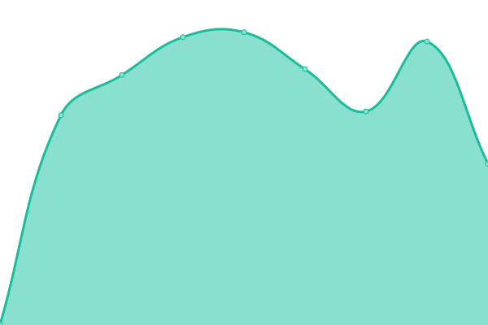

# [📈 Live Status](https://status.tjo.space): <!--live status--> **🟧 Partial outage**

This repository contains the open-source uptime monitor and status page for [tjo.space](https://tjo.space), powered by [Upptime](https://github.com/upptime/upptime).

With [Upptime](https://upptime.js.org), you can get your own unlimited and free uptime monitor and status page, powered entirely by a GitHub repository. We use [Issues](https://github.com/upptime/upptime/issues) as incident reports, [Actions](https://github.com/tjo-space/status/actions) as uptime monitors, and [Pages](https://status.tjo.space) for the status page.

<!--start: status pages-->
<!-- This summary is generated by Upptime (https://github.com/upptime/upptime) -->
<!-- Do not edit this manually, your changes will be overwritten -->
<!-- prettier-ignore -->
| URL | Status | History | Response Time | Uptime |
| --- | ------ | ------- | ------------- | ------ |
|  [media.tjo.space](https://media.tjo.space) | 🟩 Up | [media-tjo-space.yml](https://github.com/tjo-space/status/commits/HEAD/history/media-tjo-space.yml) | 

 672ms
     
 | 

<a href="https://status.tjo.space/history/media-tjo-space">98.90%</a>
    

|  [cloud.tjo.space](https://cloud.tjo.space) | 🟥 Down | [cloud-tjo-space.yml](https://github.com/tjo-space/status/commits/HEAD/history/cloud-tjo-space.yml) | 

 1359ms
     
 | 

<a href="https://status.tjo.space/history/cloud-tjo-space">54.20%</a>
    

|  [chat.tjo.space](https://chat.tjo.space) | 🟩 Up | [chat-tjo-space.yml](https://github.com/tjo-space/status/commits/HEAD/history/chat-tjo-space.yml) | 

 600ms
     
 | 

<a href="https://status.tjo.space/history/chat-tjo-space">54.77%</a>
    

|  [id.tjo.space](https://id.tjo.space) | 🟩 Up | [id-tjo-space.yml](https://github.com/tjo-space/status/commits/HEAD/history/id-tjo-space.yml) | 

 503ms
     
 | 

<a href="https://status.tjo.space/history/id-tjo-space">98.72%</a>
    

|  [code.tjo.space](https://code.tjo.space) | 🟩 Up | [code-tjo-space.yml](https://github.com/tjo-space/status/commits/HEAD/history/code-tjo-space.yml) | 

 650ms
     
 | 

<a href="https://status.tjo.space/history/code-tjo-space">98.91%</a>
    

|  [home.tjo.space](https://home.tjo.space) | 🟩 Up | [home-tjo-space.yml](https://github.com/tjo-space/status/commits/HEAD/history/home-tjo-space.yml) | 

 1008ms
     
 | 

<a href="https://status.tjo.space/history/home-tjo-space">98.73%</a>
    

|  [mail.tjo.space SMTP](mail.tjo.space) | 🟩 Up | [mail-tjo-space-smtp.yml](https://github.com/tjo-space/status/commits/HEAD/history/mail-tjo-space-smtp.yml) | 

 168ms
     
 | 

<a href="https://status.tjo.space/history/mail-tjo-space-smtp">99.28%</a>
    

|  [mail.tjo.space IMAP](mail.tjo.space) | 🟩 Up | [mail-tjo-space-imap.yml](https://github.com/tjo-space/status/commits/HEAD/history/mail-tjo-space-imap.yml) | 

 162ms
     
 | 

<a href="https://status.tjo.space/history/mail-tjo-space-imap">99.27%</a>
    

<!--end: status pages-->

[**Visit our status website →**](https://status.tjo.space)

## 📄 License

- Powered by: [Upptime](https://github.com/upptime/upptime)
- Code: [MIT](./LICENSE) © [Upptime](https://upptime.js.org)
- Data in the `./history` directory: [Open Database License](https://opendatacommons.org/licenses/odbl/1-0/)
