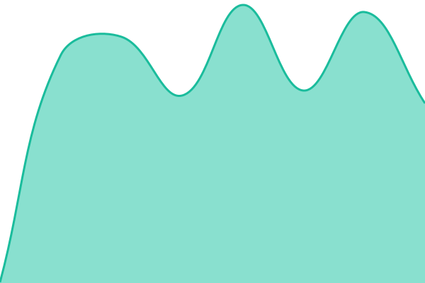

# [📈 Live Status](https://status.tjo.space): <!--live status--> **🟧 Partial outage**

This repository contains the open-source uptime monitor and status page for [tjo.space](https://tjo.space), powered by [Upptime](https://github.com/upptime/upptime).

With [Upptime](https://upptime.js.org), you can get your own unlimited and free uptime monitor and status page, powered entirely by a GitHub repository. We use [Issues](https://github.com/upptime/upptime/issues) as incident reports, [Actions](https://github.com/tjo-space/status/actions) as uptime monitors, and [Pages](https://status.tjo.space) for the status page.

<!--start: status pages-->
<!-- This summary is generated by Upptime (https://github.com/upptime/upptime) -->
<!-- Do not edit this manually, your changes will be overwritten -->
<!-- prettier-ignore -->
| URL | Status | History | Response Time | Uptime |
| --- | ------ | ------- | ------------- | ------ |
|  [tjo.space](https://tjo.space) | 🟩 Up | [tjo-space.yml](https://github.com/tjo-space/status/commits/HEAD/history/tjo-space.yml) | 

 1005ms
     
 | 

<a href="https://status.tjo.space/history/tjo-space">97.87%</a>
    

|  [search.tjo.space](https://search.tjo.space) | 🟩 Up | [search-tjo-space.yml](https://github.com/tjo-space/status/commits/HEAD/history/search-tjo-space.yml) | 

 653ms
     
 | 

<a href="https://status.tjo.space/history/search-tjo-space">97.88%</a>
    

|  [media.tjo.space](https://media.tjo.space) | 🟩 Up | [media-tjo-space.yml](https://github.com/tjo-space/status/commits/HEAD/history/media-tjo-space.yml) | 

 1067ms
     
 | 

<a href="https://status.tjo.space/history/media-tjo-space">99.02%</a>
    

|  [cloud.tjo.space](https://cloud.tjo.space/status.php) | 🟥 Down | [cloud-tjo-space.yml](https://github.com/tjo-space/status/commits/HEAD/history/cloud-tjo-space.yml) | 

 636ms
     
 | 

<a href="https://status.tjo.space/history/cloud-tjo-space">97.87%</a>
    

|  [photos.tjo.space](https://photos.tjo.space/api/server/ping) | 🟥 Down | [photos-tjo-space.yml](https://github.com/tjo-space/status/commits/HEAD/history/photos-tjo-space.yml) | 

 591ms
     
 | 

<a href="https://status.tjo.space/history/photos-tjo-space">97.88%</a>
    

|  [chat.tjo.space](https://chat.tjo.space) | 🟩 Up | [chat-tjo-space.yml](https://github.com/tjo-space/status/commits/HEAD/history/chat-tjo-space.yml) | 

 562ms
     
 | 

<a href="https://status.tjo.space/history/chat-tjo-space">97.88%</a>
    

|  [matrix.chat.tjo.space](https://matrix.chat.tjo.space/health) | 🟩 Up | [matrix-chat-tjo-space.yml](https://github.com/tjo-space/status/commits/HEAD/history/matrix-chat-tjo-space.yml) | 

 550ms
     
 | 

<a href="https://status.tjo.space/history/matrix-chat-tjo-space">97.89%</a>
    

|  [webhook.chat.tjo.space](https://webhook.chat.tjo.space) | 🟩 Up | [webhook-chat-tjo-space.yml](https://github.com/tjo-space/status/commits/HEAD/history/webhook-chat-tjo-space.yml) | 

 550ms
     
 | 

<a href="https://status.tjo.space/history/webhook-chat-tjo-space">97.89%</a>
    

|  [id.tjo.space](https://id.tjo.space) | 🟩 Up | [id-tjo-space.yml](https://github.com/tjo-space/status/commits/HEAD/history/id-tjo-space.yml) | 

 1316ms
     
 | 

<a href="https://status.tjo.space/history/id-tjo-space">95.65%</a>
    

|  [code.tjo.space](https://code.tjo.space) | 🟩 Up | [code-tjo-space.yml](https://github.com/tjo-space/status/commits/HEAD/history/code-tjo-space.yml) | 

 675ms
     
 | 

<a href="https://status.tjo.space/history/code-tjo-space">99.02%</a>
    

|  [rss.tjo.space](https://rss.tjo.space/api/fever.php) | 🟩 Up | [rss-tjo-space.yml](https://github.com/tjo-space/status/commits/HEAD/history/rss-tjo-space.yml) | 

 536ms
     
 | 

<a href="https://status.tjo.space/history/rss-tjo-space">97.89%</a>
    

|  [vault.tjo.space](https://vault.tjo.space) | 🟩 Up | [vault-tjo-space.yml](https://github.com/tjo-space/status/commits/HEAD/history/vault-tjo-space.yml) | 

 677ms
     
 | 

<a href="https://status.tjo.space/history/vault-tjo-space">97.89%</a>
    

|  [any.ingress.tjo.cloud](http://any.ingress.tjo.cloud:1337/healthz) | 🟩 Up | [any-ingress-tjo-cloud.yml](https://github.com/tjo-space/status/commits/HEAD/history/any-ingress-tjo-cloud.yml) | 

 323ms
     
 | 

<a href="https://status.tjo.space/history/any-ingress-tjo-cloud">100.00%</a>
    

|  [monitor.tjo.cloud](https://monitor.tjo.cloud) | 🟩 Up | [monitor-tjo-cloud.yml](https://github.com/tjo-space/status/commits/HEAD/history/monitor-tjo-cloud.yml) | 

 2292ms
     
 | 

<a href="https://status.tjo.space/history/monitor-tjo-cloud">95.66%</a>
    

|  [postgresql.tjo.cloud](https://postgresql.tjo.cloud) | 🟩 Up | [postgresql-tjo-cloud.yml](https://github.com/tjo-space/status/commits/HEAD/history/postgresql-tjo-cloud.yml) | 

 1050ms
     
 | 

<a href="https://status.tjo.space/history/postgresql-tjo-cloud">97.90%</a>
    

|  [mail.tjo.cloud SMTP](mail.tjo.cloud) | 🟩 Up | [mail-tjo-cloud-smtp.yml](https://github.com/tjo-space/status/commits/HEAD/history/mail-tjo-cloud-smtp.yml) | 

 137ms
     
 | 

<a href="https://status.tjo.space/history/mail-tjo-cloud-smtp">97.90%</a>
    

|  [mail.tjo.space IMAP](mail.tjo.cloud) | 🟩 Up | [mail-tjo-space-imap.yml](https://github.com/tjo-space/status/commits/HEAD/history/mail-tjo-space-imap.yml) | 

 136ms
     
 | 

<a href="https://status.tjo.space/history/mail-tjo-space-imap">97.91%</a>
    

<!--end: status pages-->

[**Visit our status website →**](https://status.tjo.space)

## 📄 License

- Powered by: [Upptime](https://github.com/upptime/upptime)
- Code: [MIT](./LICENSE) © [Upptime](https://upptime.js.org)
- Data in the `./history` directory: [Open Database License](https://opendatacommons.org/licenses/odbl/1-0/)
